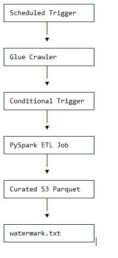
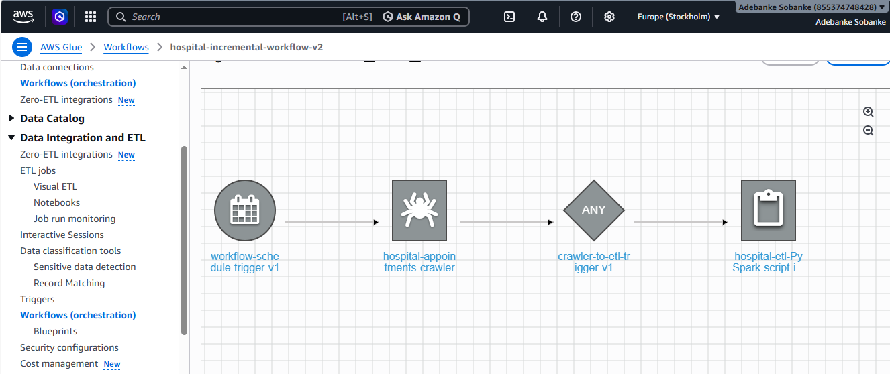
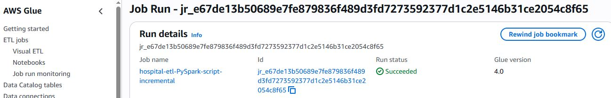
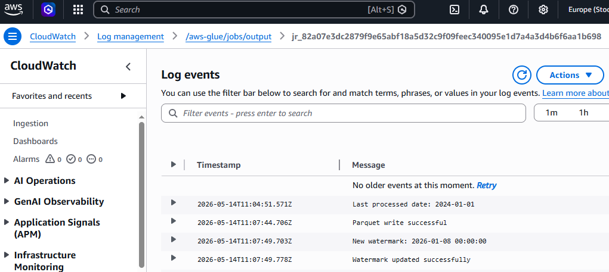

# AWS Glue Incremental ETL Pipeline

## Architecture Diagram

## Overview
## Workflow Orchestration

The pipeline uses AWS Glue Workflows to orchestrate the end-to-end ETL process.

Workflow execution follows this sequence:

1. A scheduled trigger starts the workflow automatically.
2. The AWS Glue crawler scans raw hospital datasets stored in Amazon S3.
3. A conditional trigger waits for crawler completion.
4. The PySpark ETL job starts automatically after crawler success.
5. The ETL pipeline processes incremental records and writes curated parquet outputs to Amazon S3.

This orchestration design enables automated, production-style pipeline execution without manual intervention.

## ETL Script
The PySpark ETL implementation is located here:

`scripts/hospital_etl_incremental.py`

The script performs:
- incremental watermark filtering
- Spark joins and aggregations
- parquet output generation
- automated watermark updates
- CloudWatch operational logging

## CloudWatch Monitoring

Amazon CloudWatch is used for operational monitoring and ETL observability.

The ETL job writes execution logs to CloudWatch, including:

- watermark processing status
- incremental record detection
- parquet write confirmation
- ETL execution progress
- error and exception tracking

Example monitored events include:
- Last processed date
- Parquet write successful
- New watermark generated
- Watermark updated successfully

These logs provide visibility into pipeline execution and simplify troubleshooting and operational support.

Workflow screenshot

ETL execution screenshot

CloudWatch screenshot

This project implements a fully automated incremental ETL pipeline using AWS Glue, PySpark, Amazon S3, and CloudWatch.

The pipeline:
- processes hospital appointment data
- performs incremental filtering using watermarking
- stores partitioned parquet outputs
- uses workflow orchestration and conditional triggers# aws-glue-incremental-etl-pipeline

  ## Tech Stack

- AWS Glue
- PySpark
- Amazon S3
- CloudWatch

  ## Features

- Incremental watermark processing
- Workflow orchestration
- Partitioned parquet output
- Conditional triggers
